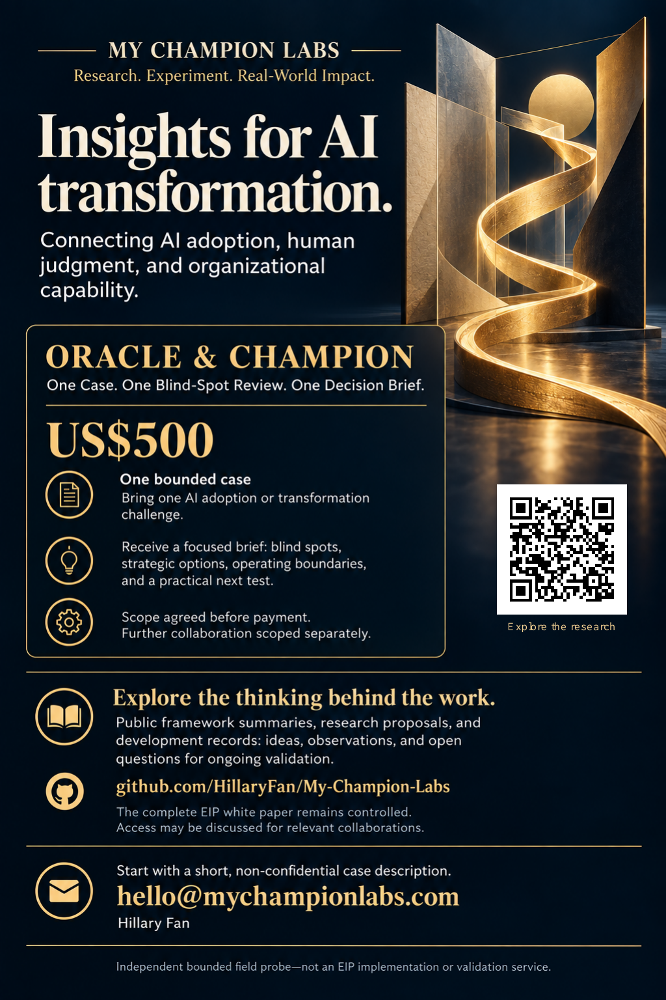

# My Champion Labs

**Research. Experiment. Real-World Impact.**

My Champion Labs brings together Hillary Fan's research and product proposals on long-term human–AI collaboration. The work asks how useful capability can develop through collaboration, what deserves to be retained, and how it can carry into another task or setting without losing accuracy, human control, or its source.

A recurring concern is the work people do to keep AI useful: explaining context again, checking outputs, repairing misunderstandings, and rebuilding unfinished work after a handoff. The projects examine different parts of that problem, from enterprise operating models to care coordination and observable AI behavior.

This is a public research and development record. The projects have distinct purposes and evidence stages; they are not a single deployed product or a set of results that validate one another.

## Find your starting point

| Your question | Project and reading path | Current stage |
| --- | --- | --- |
| How can human–AI work become reusable, accountable enterprise capability? | [Ephemeral Intelligence Protocol™ (EIP™)](https://github.com/HillaryFan/Ephemeral-Intelligence-Protocol) — separate framework repository | v2.1 reviewed integration draft; bounded organizational testing remains to be done |
| How can everyday conversation become participant-controlled information for care? | [AI Health Companion](projects/ai-health-companion/README.md) — [English V3](projects/ai-health-companion/docs/main-proposal/MAIN_PROPOSAL_V3.md), [中文 V3](projects/ai-health-companion/zh-TW/MAIN_PROPOSAL_V3.md), [market research](projects/ai-health-companion/research/market-competitive-analysis/README.md) | Product proposal and validation plan |
| How can AI switch tasks and roles while preserving sources, priorities, safety, and continuity? | [Project Black Sheep](projects/project-black-sheep/README.md) — Dynamic Frame Governance | Public research P1.2; reported candidate observations and a controlled evaluation proposal |
| Can capability developed through long-term collaboration help someone with a real external problem? | [Oracle & Champion](PILOT.md) — one case, one blind-spot review, one decision brief | Independent paid field probe; usefulness and delivery burden to be tested |
| Can generative interaction help people observe their own recurring relational patterns? | [Generative Relational Psychology](generative-relational-psychology/README.md) — [Research Note 001](generative-relational-psychology/RESEARCH_NOTE_001_Generative_Relational_Psychology.md) | Conceptual research note v0.1 |

## How these questions developed

For a less technical introduction, read [Organizations That Learn with AI](docs/research-history/README.md), a short selection from the author's essays and reflections. It traces the questions behind EIP: repeated work, institutional learning, human judgment, and the effort people absorb to keep AI useful.

The selection is a historical reading companion, not the current EIP specification or evidence of proven outcomes. Its editorial notes separate earlier proposals from the current public baseline. A [downloadable PDF](docs/research-history/Organizations_That_Learn_with_AI_GitHub_G1.pdf) accompanies the readable Markdown.

## How the projects relate

EIP is a separate proprietary enterprise operating-model framework. My Champion Labs hosts research and experiments that may share its questions about selective retention, human judgment, and accountable reuse. They do not all depend on EIP, and their outcomes do not automatically validate or invalidate it.

AI Health Companion provides a proposed high-risk application of the behavior studied by Black Sheep: natural interaction must yield to safety while consent, source distinctions, and reporting rules remain intact. That is a connection between requirements, not completed evidence of AGI or an implemented shared architecture.

Generative Relational Psychology studies the human side of interaction and self-observation. Black Sheep studies observable AI control behavior. Neither treats warmth or role-play as proof of AI consciousness or feelings.

Oracle & Champion tests external usefulness through a bounded paid engagement. It is not an EIP pilot, implementation, or validation program. See [project roles and the relationship to EIP](docs/EIP_RELATIONSHIP.md).

## Oracle & Champion

**One Case. One Blind-Spot Review. One Decision Brief.**

Bring a real, bounded problem at the intersection of AI capability, human judgment, operating models, or emerging product capability. The experiment examines whether a longitudinal human–AI collaboration can identify a useful blind spot, outline alternatives, and clarify what to test next.

Read the [offer and research questions](PILOT.md) or the [current v4 poster](assets/My_Champion_Labs_Poster_v4.pdf). A paid case tests usefulness and production burden; it does not establish a validated agent or consulting model.

The poster links to the public research behind the work. Scope is agreed before payment; any further collaboration is scoped separately. Access to controlled EIP materials is not included automatically.

## Evidence, versions, and public use

- [Research scope](docs/RESEARCH_SCOPE.md) — questions and terminology across the public work.
- [Evidence boundary](EVIDENCE_BOUNDARY.md) — what observations and timestamped records support.
- [Timestamp ledger](TIMESTAMP_LEDGER.md) — selected research chronology and public updates.
- [Health Companion version history](projects/ai-health-companion/VERSION_HISTORY.md) — current V3 and preserved English and Chinese V2 editions.
- [Black Sheep source and version record](projects/project-black-sheep/SOURCE_REGISTER.md) — public adaptation lineage and evidence status.
- [Public asset register](assets/README.md) — current flyer, unchanged historical versions, and integrity hashes.
- [Rights and use notice](NOTICE.md) — attribution and publication boundaries; no new license is granted here.

Private conversations, identifiable participant records, controlled implementation materials, and commercial evidence are not part of this public collection. Each project distinguishes proposals and observations from validated results.

## Contact

For a bounded case or a focused research or product collaboration, contact [hello@mychampionlabs.com](mailto:hello@mychampionlabs.com). Please do not send confidential or medical material through public repository channels.

© 2026 Hillary Fan. All rights reserved except where explicitly stated otherwise.
